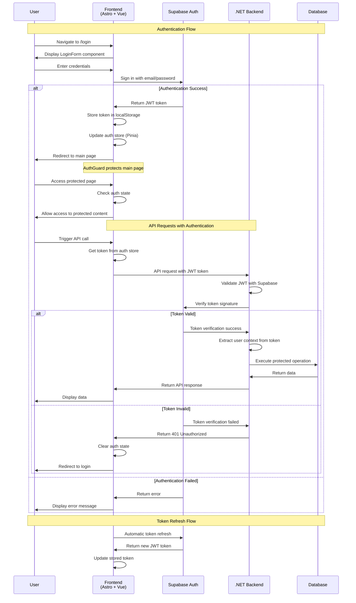
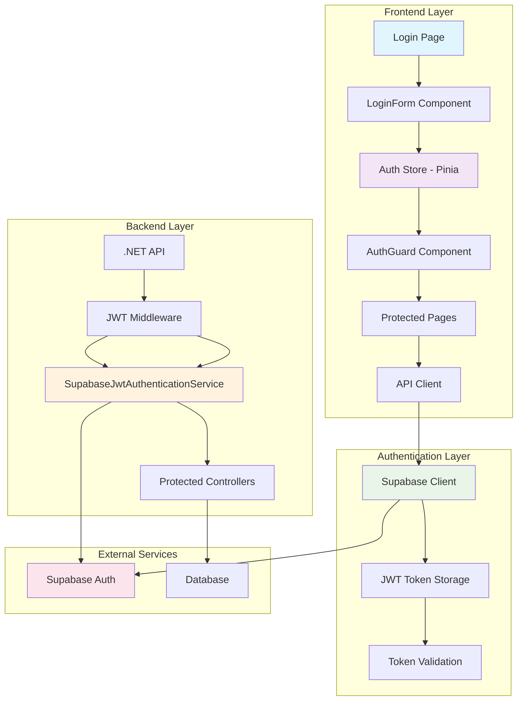
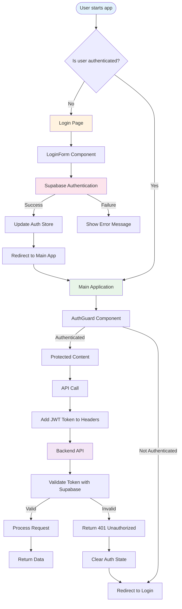
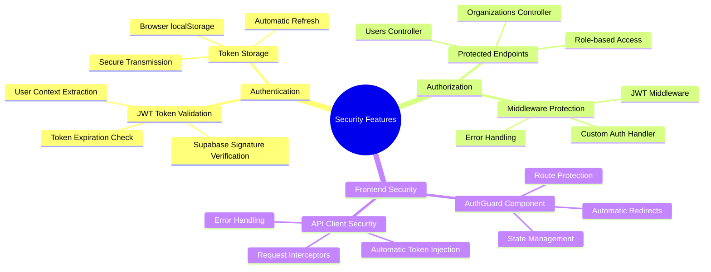
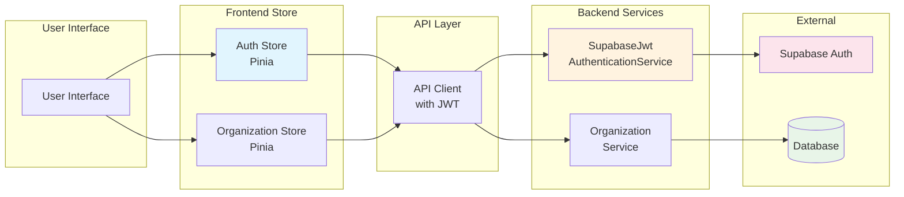

# Authentication Flow Diagram

This diagram illustrates the complete authentication flow in the 10xWarehouse application using Supabase authentication.

## Architecture Overview

## Component Interaction Flow

## Security Features Diagram

## Data Flow Diagram

This documentation provides a comprehensive view of how authentication works in your 10xWarehouse application, showing the flow from user login through protected API calls and the security measures in place.
